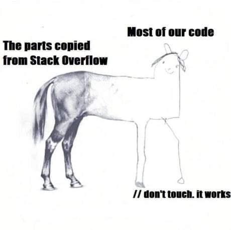

# rp2019
Rakenduste programmeerimine  
Kursus  
2019  
heroku URL: https://daniel--app.herokuapp.com/  

K: Mis asi on Babel?
V: Babel on JavaScript-i kompilaator, mis võimaldab uued JS kooditükid (ES6) konverteerida vanaks koodiks, et saaks neid tööle panna vanades brauserides.
